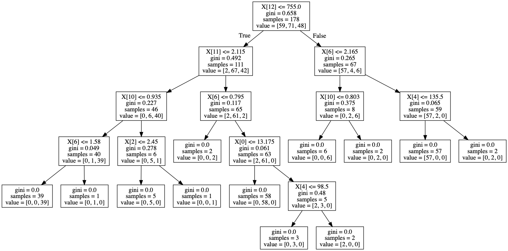
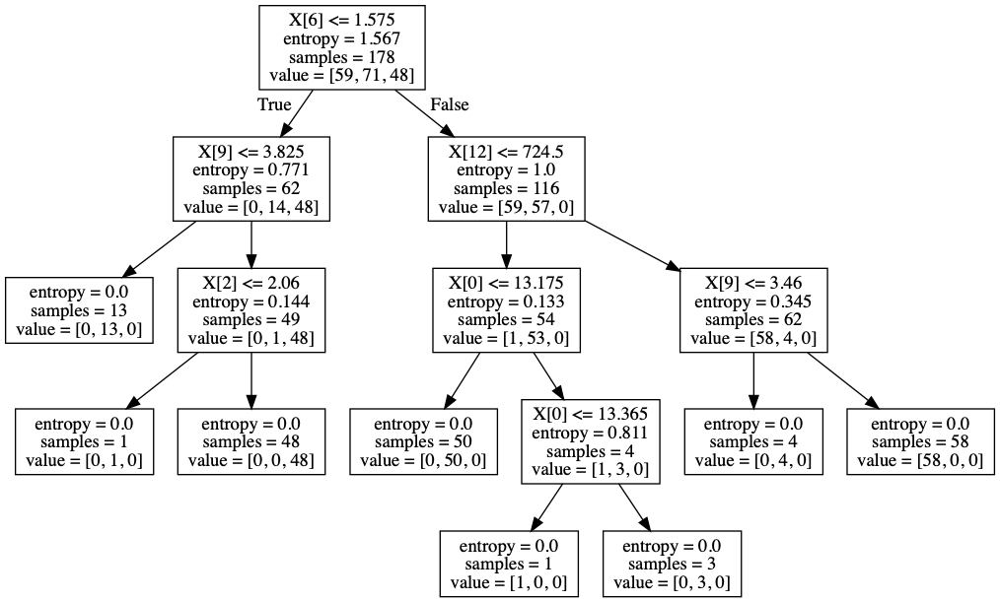
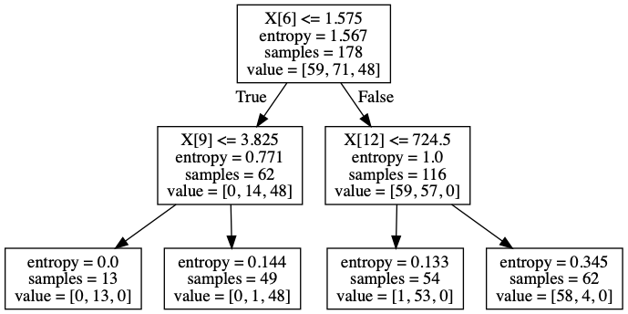

### 1. 针对 Wine Quality Data Set 数据集，使用决策树（Hint: DecisionTreeClassifier）进行分类。有兴趣的同学可以尝试把决策树进行可视化(Hint: 使用sklearn.tree.export_graphviz)。

### 2. 使用不同的划分准则及不同的max_depth进行实验并记录，观察效果。

notes

交叉验证中，[cross_val_score](https://scikit-learn.org/stable/modules/generated/sklearn.model_selection.cross_val_score.html)不分层抽样，[StratifiedKFold](https://scikit-learn.org/stable/modules/generated/sklearn.model_selection.StratifiedKFold.html) and [StratifiedShuffleSplit](https://scikit-learn.org/stable/modules/generated/sklearn.model_selection.StratifiedShuffleSplit.html)分层抽样

Homebrew安装的包[不需要再设置PATH](https://www.jianshu.com/p/529b7558a6e0)

pydot与python3存在某些不兼容，可以运行但是有奇怪的Warning，换用pydotplus或者pydot3

```python3
from sklearn.datasets import load_wine
from sklearn import tree
from io import StringIO  # 用于内存读写
import pydotplus

wine = load_wine()
clf = tree.DecisionTreeClassifier()
clf = clf.fit(wine.data, wine.target)

dot_data = StringIO()
tree.export_graphviz(clf, out_file=dot_data)
graph = pydotplus.graph_from_dot_data(dot_data.getvalue())
graph.write_png("wine_gini.png")
```


```python3
from sklearn.datasets import load_wine
from sklearn import tree
from io import StringIO  # 用于内存读写
import pydotplus

wine = load_wine()
clf = tree.DecisionTreeClassifier(criterion="entropy")
clf = clf.fit(wine.data, wine.target)

dot_data = StringIO()
tree.export_graphviz(clf, out_file=dot_data)
graph = pydotplus.graph_from_dot_data(dot_data.getvalue())
graph.write_pdf("wine_entropy.pdf")
```



```python3
from sklearn.datasets import load_wine
from sklearn import tree
from io import StringIO  # 用于内存读写
import pydotplus

wine = load_wine()
clf = tree.DecisionTreeClassifier(criterion="entropy", max_depth=2)
clf = clf.fit(wine.data, wine.target)

dot_data = StringIO()
tree.export_graphviz(clf, out_file=dot_data)
graph = pydotplus.graph_from_dot_data(dot_data.getvalue())
graph.write_pdf("wine_entropy_maxdepth=2.pdf")
```

